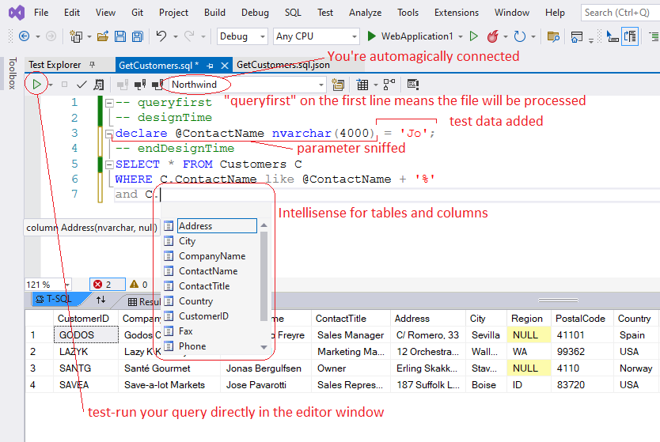

# Authoring SQL

In Visual Studio, .sql files will open in the marvelous TSQL editor window. If you're database is SQL Server, QueryFirst will automatically connect the editor window to the database (using your qfconfig defaultConnection). You should now see your tables and columns popping up in Intellisense suggestions.


<p align="center" style="font-size:smaller">The marvelous TSQL editor</p>

## Parameters

To add a parameter, just start using it directly in your SQL. With SQL Server, there's nothing else to do. When you save, we detect the parameters used in the query and add them as local variables in the designTime section. When we then generate the C# wrapper, these local variables will be converted to strongly typed ADO parameters. In the generated execute methods, the parameter order will be taken from the designTime section, so you can reorder the lines if you want to. 

In some situations, QueryFirst will be unable to sniff your parameters and an otherwise healthy query will fail with a `must declare local variable` error. Do not panic. You just need declare the parameter as a local variable in the design time section.

## Run your query as you develop

You can test-run your query as you develop just by clicking play in the editor window. You can assign some test values to your parameters in the designTime section so that your query always runs and returns something. This designTime section is ignored at runtime.

## Null

Who ever liked or understood `DBNull.Value`? In QueryFirst, nulls are nulls. Nulls supplied as parameters to Execute methods become DB nulls in the query. Nulls returned by queries become C# nulls. If you're not already familiar with sql functions `isnull()` and `coalesce()`, they are very handy for optional filters, and for fine-grained control over your results.

`ExecuteScalar()` always returns a nullable type, in case an execution returns no results. Likewise, GetOne() returns null if it finds nothing. The other Execute methods, if they return no results, will return an empty List, or an empty IEnumerable.

## Do you really need the designTime section?

If your query is simple, your parameters are only used once each and you have no need for test data, you can, and probably should, delete the design time section. Like this, every time your query is regenerated, we will use the freshly fetched data-type for the generated parameters. If you leave the designTime section, and you later change your column datatype in the DB, you will need to manually hunt down and update these declarations. (Potential gotcha!) You can always add a designTime section again if you need it.

## Scaffolding INSERTS and UPDATES

QueryFirst can help you with inserts and updates. Type `INSERT into [MyTable]...` and save. QueryFirst will scaffold an INSERT statement for the table. The same goes for updates: `UPDATE [MyTable]...` and save. This is a one-time operation. Once generated, it's up to you to customise and maintain these requests.

## Dynamic ORDER BY

One of the pain points of raw SQL for data access is the complexity of constructing a request where the sort is specified at runtime, a very common requirement. QueryFirst can help you with this, by modifying your sql at runtime, dynamically constructing the ORDER BY clause based on the parameters you supply. To see this in action, just add the flag `‑‑ qfOrderBy` to your query, as follows...

```sql
SELECT * FROM Customers C
WHERE C.Name like @searchTerm + '%'
-- qfOrderBy
```

The flag will be replaced at runtime with the constructed ORDER BY clause, so take care to put it in the right place. When you save, your `Execute()` methods will now have an orderBy argument. This is an array of tuples, each tuple consisting of a column (from the Cols enum on the repository) and a sort direction (false is ascending). The following code shows how to specify the sort in your calling code...

```csharp
var query = new GetCustomersQfRepo(testDB);
var sorted = query.Execute(new[] { 
    (GetCustomersQfRepo.Cols.Country, false),
    (GetCustomersQfRepo.Cols.State, false) 
});
// false is ascending
```

If you want to combine dynamic ORDER BY with pagination using an OFFSET clause, the simple `‑‑ qfOrderBy` flag will not be enough, since OFFSET requires an ORDER BY clause to be valid. In that case, do this...

```sql
SELECT * FROM Customers C
-- qfOrderBy
ORDER BY C.CreatedAt DESC, id DESC
-- endQfOrderBy
OFFSET (@page-1)*@pageSize ROWS
FETCH NEXT @pageSize ROWS ONLY
```

The ORDER BY clause above will only be used at design time, so we have a valid query for test-running and  schema fetching. At runtime, everything between the opening and closing tags will be replaced with the generated ORDER BY clause.

## QueryFirst Expando-params (Dynamic IN)

In the same spirit, another common pain point is the `IN()` function. People would love to supply a list of arguments as a parameter, but raw SQL obliges you to commit up-front to the number of values in your IN, and to parameterise them one at a time. Table-valued parameters provide a way round this, but QueryFirst can do better. Just do this...

```sql
WHERE CustomerId IN(@ListOfCustomerIds)
```

...to get this...

```csharp
Execute(List<int> listOfCustomerIds)
```

QueryFirst sees that your parameter is inside an IN(), and will infer that you want to provide many values. In the generated Execute() methods, you'll be asked for a List. QueryFirst will join these into a string and inject them directly into your query text at runtime. Real ADO parameters are not used, but strong typing and string sanitising ensure that this feature is safe. 

## Table-valued Parameters

QueryFirst greatly simplifies the use of [table-valued parameters](https://docs.microsoft.com/en-us/sql/relational-databases/tables/use-table-valued-parameters-database-engine). Outside of your query, you need first to create your datatype. In SSMS, these will appear under Programmability=>Types=>User-Defined Table Types. Then, in your query file, to create a table-valued parameter, you just need to declare it in the `‑‑ designTime` section, as follows...

```sql
/* .sql query managed by QueryFirst add-in */
-- designTime - put parameter declarations and design time initialization here
DECLARE @MyTVP CustomerType;
-- endDesignTime

INSERT into Customers (CustName, Postcode) 
(SELECT CTVP.CustName, CTVP.Postcode  FROM @MyTVP CTVP)
```

This will give you generated methods like the following...

```csharp
public int ExecuteNonQuery(IEnumerable<CustomerType> myTVP)
...

public class CustomerType{
    public System.String CustName{get; set;}
    public System.String Postcode{get; set;}
}
```

QueryFirst cannot automatically sniff table-valued parameters in your SQL, like it can with primitive types, so you will need to manually declare them as shown above. But once you do this, we can recover the type from the database and generate the matching POCO as shown in the example.

You will notice that the generated code now has a line `using FastMember;` We use Marc Gravell's marvelous FastMember package to convert your IEnumerable of POCO's to a Dataset. You will need to add the package nuget to your project. For .net core projects, you will need to specify the Microsoft.Data.SqlClient provider, as follows...

```json
// qfconfig.json
"defaultConnection": "Data Source=MyServer;Database=Northwind;Trusted_Connection=True;",
"provider": "Microsoft.Data.SqlClient"
```

## Should I use the asterisk ?

**TL;dr** Don't use asterisk queries without understanding the following:

Asterisk queries in SQL generate some controversy. Purists may balk, considering it bad to oblige the rdbms to expand your * into a column list each time the query is run.

QueryFirst muddies this picture. On the one hand, it can be quite exciting to use * queries and watch new properties magically pop up in your dto's and typescript interfaces, and this may be fine for small teams. 

For larger teams, be careful: you will want to clearly distinguish between breaking and non-breaking schema changes. Breaking schema changes (normally deletions) need to be made rapidly available to all active branches. Make the schema change in a dedicated branch. Get your app building against the new schema, then rapidly merge into develop and all active branches. Non-breaking schema changes can live quietly in a feature branch until that branch is merged.

The subtlety is that **with QueryFirst, if you have asterisk queries in your project, adding a column becomes a breaking change**. Just the presence of the column in the development DB will cause it to be picked up by asterisk queries the next time they are regenerated, in any branch. These queries will then throw if they are deployed on a DB instance that doesn't yet have the new column. (The repository class is expecting more columns than it receives, and will throw an IndexOutOfRange exception.) _Is that clear ?!_ Using QueryFirst [SelfTest()](/selftest.html) in your deployments will alert you, but won't fix the underlying problem.

There are two strategies for dealing with this.

1. Ban asterisk queries, or...
2. Consider all schema changes as potentially breaking changes. Use a dedicated, short-lived branch to regenerate all queries against the new schema, and merge this branch into develop before the next release.

Let's be careful out there :-)